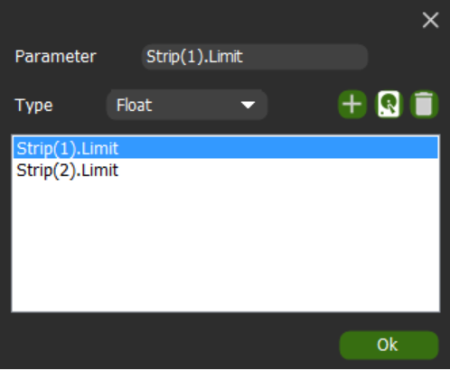

***
*This is a plugin for Macro Deck 2, it does NOT function as a standalone app*
***
## Control Voicemeeter from Macro Deck
Create a button and configure how you want to control Voicemeeter.

***
## Features

| Action | Function | Description |
| --- | --- | --- |
| Toggle | Toggle a button on a strip or bus | The most common toggles are implemented and can be selected by device name and option (Mute, A1-B3, etc) |
| Slider control | coming soon... | not implemented yet! |
| Program commands | coming soon... | not implemented yet! |
| Advanced/Custom | Send a custom command to Voicemeeter | This option allows configuring custom commands using the Voicemeeter API language, like controlling the Cassette (Voicemeeter Banana and Potato).   Please see the official [VoicemeeterRemoteAPI pdf](https://download.vb-audio.com/Download_CABLE/VoicemeeterRemoteAPI.pdf) for more info. |

##### Available parameters/variables

| Panel | Toggles | Ranges |
| --- | --- | --- |
| Strip | Mute, Mono, Solo, A1-B3* | Gain |
| Bus | Mute, Mono, Eq.On*, Sel* | Gain |
| Recorder* | Stop, Play, Record, Pause | Gain |

**Availablity of these varies with your Voicemeeter installation. Some features can only be accessed with Banana or Potato*

##### Add custom parameters to variables

Any parameter in Voicemeeter that you want to monitor can be added with the same syntax as the Advanced/Custom action.\
Access this window from the Plugin Configuration button or by clicking the status icon.\

Clicking on an option that you've already included allows you to edit or delete it. To add a new parameter, you must provide the Parameter and the Type. \
(Check the API docs: 0 or 1 values are bool, ranges are almost always float)\
*Make sure to use the New, Save and Delete buttons before you click Ok.*

***More features/actions coming soon...***

***
## Need this in your language?
This plugin has its own localization files, independent of Macro Deck.
If your language is not available, the plugin will default to English.

Check the files available in source under [Languages](MacroDeck.Voicemeeter/MacroDeck.Voicemeeter/Languages).
If your language is missing or incomplete, please consider [helping me out by translating](https://poeditor.com/join/project/I1exM7PsOc)! 

Currently available languages:
- English
- Italian
- Spanish (by Danivar)

***
## Third party licenses
This plugin makes use of:
- [Macro Deck 2 by SuchByte (Apache License 2.0)](https://macrodeck.org)
- [Extended Voicemeeter Remote API wrapper (MIT)](https://github.com/A-tG/voicemeeter-remote-api-extended)
- [Voicemeeter Remote API dll C# dynamic wrapper (MIT)](https://github.com/A-tG/Voicemeeter-Remote-API-dll-dynamic-wrapper)
- [Dynamic wrapper for unmanaged dll (MIT)](https://github.com/A-tG/Dynamic-wrapper-for-unmanaged-dll)

***
